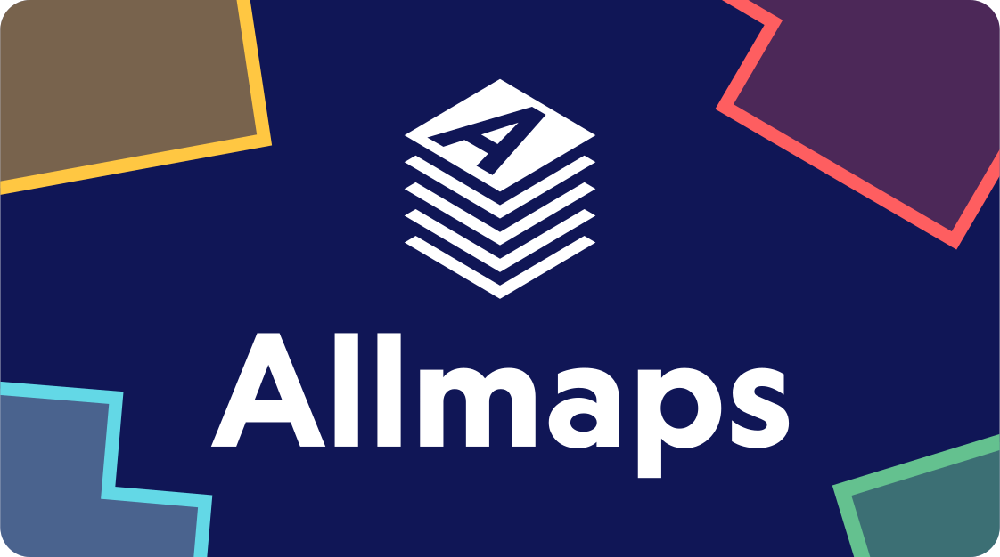
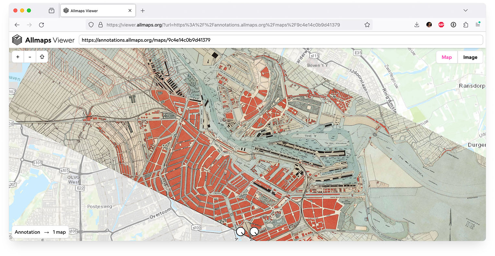

<p align=center><a href="https://allmaps.org"></a></p>

# Allmaps

100,000s of maps are available through [IIIF](https://iiif.io/), across libraries, archives and museums worldwide. Allmaps makes it easier and more inspiring to **curate, georeference and explore collections of digitized maps**.

👉 For more information about the Allmaps project, see [allmaps.org](https://allmaps.org/).

[](https://viewer.allmaps.org/?url=https%3A%2F%2Fannotations.allmaps.org%2Fmaps%2F9c4e14c0b9d41379)

## Contents

Allmaps is an open source project and consists of multiple apps and packages, all written in TypeScript and contained by this monorepo.

Apps:

- [Allmaps Viewer](apps/viewer)
- [Allmaps Tile Server](apps/tileserver)
- [Allmaps Latest](apps/latest)
- [Allmaps CLI](apps/cli)
- [Allmaps Explore](apps/explore)
- [Allmaps IIIF Viewer](apps/iiif)
- [Allmaps Here](apps/here)

Packages:

- [@allmaps/annotation](packages/annotation)
- [@allmaps/id](packages/id)
- [@allmaps/iiif-parser](packages/iiif-parser)
- [@allmaps/leaflet](packages/leaflet)
- [@allmaps/maplibre](packages/maplibre)
- [@allmaps/openlayers](packages/openlayers)
- [@allmaps/render](packages/render)
- [@allmaps/schemas](packages/schemas)
- [@allmaps/stdlib](packages/stdlib)
- [@allmaps/tailwind](packages/tailwind)
- [@allmaps/transform](packages/transform)
- [@allmaps/triangulate](packages/triangulate)
- [@allmaps/types](packages/types)
- [@allmaps/ui](packages/ui)

To see how these apps and packages are related, check out the [dependency graph](https://observablehq.com/@allmaps/javascript-dependencies).

## Contributing

We're welcoming contributions! You can read more about the many ways you can contribute [here](./CONTRIBUTING.md).

## Installation

Make sure you have Node.js (version 20.8 or higher) and [pnpm](https://pnpm.io/) installed.

You can [install pnpm with Corepack](https://pnpm.io/installation#using-corepack):

```sh
corepack enable
corepack use pnpm@8.10.0
```

Then, clone this repository locally:

```sh
git clone https://github.com/allmaps/allmaps.git
cd allmaps
```

Finally, initialize the repository:

```sh
pnpm run init
```

The `init` script is a shorthand for the following commands:

1. `pnpm install --recursive`: install all dependencies for all packages and apps.
2. `pnpm run build:packages`: build all packages to ensure all JavaScript exports are created from TypeScript files.
3. `pnpm run check`: initialize SvelteKit apps.
4. `pnpm run build:apps`: build SvelteKit apps.

If things stop working later on, you can always run the `init` script again.

### Running a single app locally

To run the `dev` script for a single app, you need to run the `watch` scripts of all packages in one terminal window:

```sh
pnpm run watch
```

And then run the `dev` script of the app in another:

```sh
pnpm --filter "@allmaps/viewer" run dev
```

You can also run the `dev` script from the app's directory instead:

```sh
cd apps/viewer
pnpm run dev
```

### Running all packages and apps locally

To run the `watch` and `dev` scripts for all packages and apps, run the following in one terminal window:

```sh
pnpm run watch
```

And this in another:

```sh
pnpm run dev
```

## Troubleshooting

If things don't work, it might help to reinitialize the SvelteKit apps:

```sh
pnpm run check
```

Or, reinstall dependencies and create the monorepo's symlinks:

```sh
pnpm install -r
```

As a last resort, you can try to remove some (or all) `node_modules` directories using [npkill](https://npkill.js.org/):

```sh
pnpm dlx npkill
```

## Commit changes

This repository uses [Husky](https://typicode.github.io/husky/) to run type checking, code linting and tests before each commit.

To skip these tests, you can use git's `--no-verify` option:

```sh
git commit --no-verify
```

## Check formatting and types

Check TypeScript types for all packages:

```sh
pnpm run types
```

Run [Prettier](https://prettier.io/) and [ESLint](https://eslint.org/) for all packages:

```sh
pnpm run lint
```

## Run tests

Run tests for all packages and apps:

```sh
pnpm run test
```

Run tests for a single package:

```sh
pnpm --filter "@allmaps/transform" test
```

You can run the tests from the package's directory instead:

```sh
cd packages/transform
pnpm test
```

# Versioning & publishing

Create prerelease versions:

```sh
lerna version prerelease
```

Publish beta versions to npm:

```sh
lerna publish from-git --dist-tag beta
```

Promoting unchanged pre-release versions:

```sh
lerna version --conventional-commits --conventional-graduate
```


# Running Allmaps in a devcontainer

You can use the devcontainer (`.devcontainer/devcontainer.json`) in this repository to run Allmaps in a Docker container. This is useful if you want to develop Allmaps on a Windows machine, or if you want to use a consistent development environment across different machines. Extensive Documentation on how to use devcontainers can be found [here](https://code.visualstudio.com/docs/devcontainers/containers). We recommend using the [Remote - Containers](https://marketplace.visualstudio.com/items?itemName=ms-vscode-remote.vscode-remote-extensionpack) extension for Visual Studio Code.

To use the devcontainer, you need to have Docker and Visual Studio Code installed. Then, open this repository in Visual Studio Code and click on the "Reopen in Container" button in the bottom right corner of the window. You can also directly clone the repository into a new devcontainer by selecting on the "Clone Repository in Container Volume" from the command palette. This will create a new devcontainer with the repository already cloned into it whithout the need to clone the repository first on your local machine.

The first time you open the devcontainer, it will take a while to build the Docker image. After that, the devcontainer will start automatically. Per default, the container will install the packages and run the init script by itself.

## Exposing the container to the local network
If you want to expose the container to the local network (e.g. to test the Allmaps Viewer on a mobile device), you need to run the "dev" script with the `--host` option:
```sh
pnpm --filter "@allmaps/viewer" run dev --host
``` 
Also you need to change the Remote: Local Port Host in you VSCode settings to "allInterfaces" to expose the ports to the local network.
```
remote.localPortHost: "allInterfaces"
```
Make sure that the basic Ssl plugin is enabled in `apps/viewer/vite.config.ts` so the crypto module is available in the browser.
