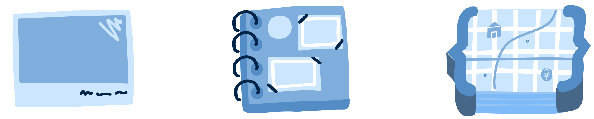

import UrlExplorer from '../../../components/UrlExplorer.svelte'

# What is the ID in Allmaps?

Illustrated viz here

- what is it used for?
- how is it computed?

# Different kinds of entities in Allmaps

# Allmaps URL syntax

This is where a URL can be loaded in to see how the Allmaps ID gets contructed.

<UrlExplorer client:only="svelte" ></UrlExplorer>

# Allmaps annotations API queries

Code snippets can go here using Allmaps IDs 
