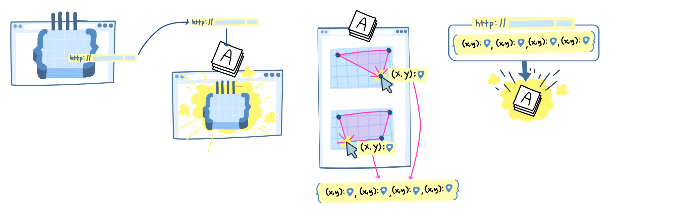
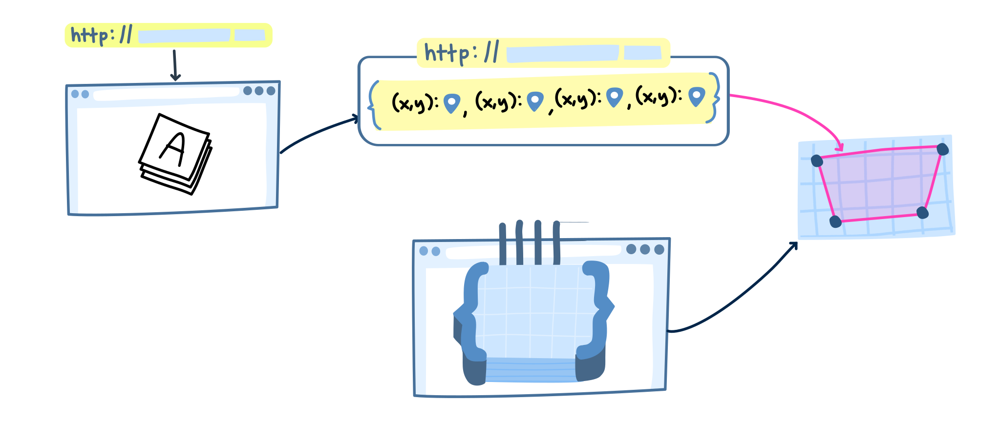

import Annotation from '../../../components/Annotation.svelte'
import AnnotationCodeBlock from '../../../components/AnnotationCodeBlock.svelte'

# What is the Allmaps Leaflet Plugin?

# How do you install the plugin?

Use a normal markdown code snippet here

# Using the plugin in your code

Use an interactive code snipet here

<AnnotationCodeBlock
  client:only="svelte"
  includePlaceholder={true}
  code="const hi = 'yo'
  for (int i = 0 ; i < 20; i++) {
     console.log()
     }"
  includePlaceholder={true}
>
<Annotation>
This could maybe show terminal lines in adding the plugin to your code
</Annotation>
</AnnotationCodeBlock>

# How to georeference a map

This SVG should probably be broken up depending on how things get written!

# How to use the plugin with the annotation you just made

<AnnotationCodeBlock
  client:only="svelte"
  includePlaceholder={true}
  code="const hi = 'yo'
  for (int i = 0 ; i < 20; i++) {
     console.log()
     }"
  includePlaceholder={true}
>
<Annotation>
Can show how the plugin is used in a sample
</Annotation>
</AnnotationCodeBlock>
