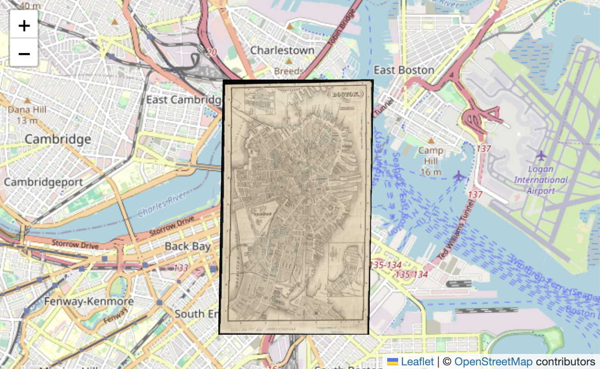

# @allmaps/leaflet

Plugin that uses WebGL to show warped IIIF images on a Leaflet map. The plugin works by loading [Georeference Annotations](https://preview.iiif.io/api/georef/extension/georef/).

## How it works

This plugin creates a new class `WarpedMapLayer` which extends and behaves like a `L.Layer`. You can add one or multiple Georeference Annotations (or Georeference Annotation Pages) to a WarpedMapLayer, and add the WarpedMapLayer to your Leaflet map. This will render all Georeferenced Maps contained in the annotation (pages) on your Leaflet map!

What happens under the hood for each Georeferenced Map, is, in short, the following:

*   The Ground Control Points are read from the Georeference Annotation, and using those a transformation is computed from IIIF resource pixels to projected geo coordinates.
*   The Resource Mask is read from the Georeference Annotation, and the area within is divided into small triangles.
*   The Viewport is transformed from projected geo coordinates backwards to the resource image, and the IIIF tiles covering this viewport are fetched and cached.
*   The area inside the Resource Mask is rendered in the Viewport, triangle by triangle, using the cached tiles. The location of the triangles is computed using the forward transformation built from the Ground Control Points.

## Installation

This package works in browsers and in Node.js as an ESM module.

Install with npm:

```sh
npm install @allmaps/leaflet
```

And load using:

```js
import { WarpedMapLayer } from '@allmaps/leaflet'
```

Alternatively, ESM and UMD bundled versions of the code are also provided under `/dist/bundled`. You can load them directly in a HTML script tag using a CDN. They require Leaflet to be loaded as `L`, so place them after loading leaflet.

```html
<script src="https://cdn.jsdelivr.net/npm/@allmaps/leaflet/dist/bundled/allmaps-leaflet-1.9.umd.js"></script>
```

When loading as bundled code, the package's functions are available under the `Allmaps` global variable:

```js
// ... (see 'Usage' below)
const warpedMapLayer = new Allmaps.WarpedMapLayer(annotationUrl)
// ...
```

## Usage

Built for Leaflet 1.9, but should work with earlier versions as well.

### Loading an annotation

A first way to add an annotation to a WarpedMapLayer is to specify the annotation or annotationUrl when creating the WarpedMapLayer.

```js
import { WarpedMapLayer } from '@allmaps/leaflet'

// Leaflet map with OSM base layer
const map = L.map('map').setView([42.35921, -71.05882], 13)
L.tileLayer('https://tile.openstreetmap.org/{z}/{x}/{y}.png', {
  attribution:
    '&copy; <a href="https://www.openstreetmap.org/copyright">OpenStreetMap</a> contributors'
}).addTo(map)

const annotationUrl = 'https://annotations.allmaps.org/images/813b0579711371e2@2c1d7e89d8c309e8'
const warpedMapLayer = new WarpedMapLayer(annotationUrl)

map.addLayer(warpedMapLayer)
```

When adding this WarpedMapLayer to the Leaflet map, the Georeferenced Map specified by the Georeference Annotation will be rendered as part of the WarpedMapLayer on the Leaflet map.

Specifying a Georeference Annotation when creating a WarpedMapLayer (as is done above) is optional. A Georeference Annotation can also be added at a later stage using the functions `addGeoreferenceAnnotation()` or `addGeoreferenceAnnotationByUrl()`. Here's an example of the first using `fetch()` and `then()`.

```js
fetch(annotationUrl)
  .then((response) => response.json())
  .then((annotation) => {
    warpedMapLayer.addGeoreferenceAnnotation(annotation)
  })
```

And here's an example of the later using a custom async function

```js
async function asyncAddGeoreferenceAnnotationByUrl() {
  // ...
  return await warpedMapLayer.addGeoreferenceAnnotationByUrl(annotationUrl)
}
asyncAddGeoreferenceAnnotationByUrl()
```

### Example

<a href="https://codepen.io/mclaeysb/pen/vYbXGjo"></a>

Click the image above to see a live CodePen example of a minimal html file that loads a Leaflet map, creates a Layer and adds a Georeference Annotation to the Layer to display it's Georeferenced Map on the Leaflet map.


### Events

The following events are emitted to inform you of the state of the WarpedMapLayer.

| Description                                                   | Type                      | Data                               |
|---------------------------------------------------------------|---------------------------|------------------------------------|
| A warped map has been added to the warped map list            | `warpedmapadded`          | `mapId: string`                    |
| A warped map has been removed from the warped map list        | `warpedmapremoved`        | `mapId: string`                    |
| A warped map enters the viewport                              | `warpedmapenter`          | `mapId: string`                    |
| A warped map leaves the viewport                              | `warpedmapleave`          | `mapId: string`                    |
| The visibility of some warpedMaps has changed                 | `visibilitychanged`       | `mapIds: string[]`                 |
| The cache loaded a first tile of a map                        | `firstmaptileloaded`      | `{mapId: string, tileUrl: string}` |
| All tiles requested for the current viewport have been loaded | `allrequestedtilesloaded` | `{}`                               |

You can listen to them in the typical Leaflet way. Here's an example:

```js
map.on('warpedmapadded', (event) => {console.log(event.mapId, warpedMapSource.getTotalBounds())}, map)
```

Some of the functions specified in the API only make sense once a warped map is loaded into the WarpedMapLayer. You can use such listeners to make sure function are run e.g. only after a warped map has been added.

### What is a 'map'?

Both Leaflet and Allmaps have a concept named a 'map'.

A Leaflet map is an instance of the [Leaflet Map Class](https://leafletjs.com/reference.html#map), the central class of the Leaflet API, used to create a map on a page and manipulate it.

In Allmaps there are multiple classes describing maps, one for each phase a map takes through the Allmaps rendering pipeline:

*   When a Georeference Annotation is parsed, an instance of the Georeferenced Map class is created from it.
*   When this map is loaded into an application for rendering, an instance of the Warped Map class is created from it.
*   (Inside the WebGL2 rendering code, there's also a WebGL2WarpedMap)

All these map phases originating from the same Georeference Annotation have the same unique `mapId` property. This string value is used though-out Allmaps (and in the API below) to identify a map. It is returned after adding a georeference annotation to a warpedMapLayer, so you can use it later to call functions on a specific map.

## API

<!-- Generated by documentation.js. Update this documentation by updating the source code. -->

#### Table of Contents

*   [WarpedMapLayer](#warpedmaplayer)
    *   [initialize](#initialize)
    *   [onAdd](#onadd)
    *   [onRemove](#onremove)
    *   [addGeoreferenceAnnotation](#addgeoreferenceannotation)
    *   [removeGeoreferenceAnnotation](#removegeoreferenceannotation)
    *   [addGeoreferenceAnnotationByUrl](#addgeoreferenceannotationbyurl)
    *   [removeGeoreferenceAnnotationByUrl](#removegeoreferenceannotationbyurl)
    *   [addGeoreferencedMap](#addgeoreferencedmap)
    *   [removeGeoreferencedMap](#removegeoreferencedmap)
    *   [getContainer](#getcontainer)
    *   [getCanvas](#getcanvas)
    *   [getWarpedMapList](#getwarpedmaplist)
    *   [getWarpedMap](#getwarpedmap)
    *   [showMap](#showmap)
    *   [showMaps](#showmaps)
    *   [hideMap](#hidemap)
    *   [hideMaps](#hidemaps)
    *   [isMapVisible](#ismapvisible)
    *   [setMapResourceMask](#setmapresourcemask)
    *   [setMapsTransformationType](#setmapstransformationtype)
    *   [getTotalBbox](#gettotalbbox)
    *   [getTotalProjectedBbox](#gettotalprojectedbbox)
    *   [getTotalBounds](#gettotalbounds)
    *   [getTotalProjectedBounds](#gettotalprojectedbounds)
    *   [bringMapsToFront](#bringmapstofront)
    *   [sendMapsToBack](#sendmapstoback)
    *   [bringMapsForward](#bringmapsforward)
    *   [sendMapsBackward](#sendmapsbackward)
    *   [getMapZIndex](#getmapzindex)
    *   [getZIndex](#getzindex)
    *   [setZIndex](#setzindex)
    *   [setImageInfoCache](#setimageinfocache)
    *   [bringToFront](#bringtofront)
    *   [bringToBack](#bringtoback)
    *   [getPaneName](#getpanename)
    *   [getOpacity](#getopacity)
    *   [setOpacity](#setopacity)
    *   [setMapOpacity](#setmapopacity)
    *   [resetMapOpacity](#resetmapopacity)
    *   [setSaturation](#setsaturation)
    *   [resetSaturation](#resetsaturation)
    *   [setMapSaturation](#setmapsaturation)
    *   [resetMapSaturation](#resetmapsaturation)
    *   [setRemoveColor](#setremovecolor)
    *   [resetRemoveColor](#resetremovecolor)
    *   [setMapRemoveColor](#setmapremovecolor)
    *   [resetMapRemoveColor](#resetmapremovecolor)
    *   [setColorize](#setcolorize)
    *   [resetColorize](#resetcolorize)
    *   [setMapColorize](#setmapcolorize)
    *   [resetMapColorize](#resetmapcolorize)

### WarpedMapLayer

WarpedMapLayer class.

Renders georeferenced maps of a IIIF Georeference Annotation on a Leaflet map.
WarpedMapLayer extends Leaflet's [L.Layer](https://leafletjs.com/reference.html#layer).

#### initialize

Creates a WarpedMapLayer

##### Parameters

*   `annotation` **unknown?** Georeference Annotation or URL pointing to an Annotation
*   `options` **WarpedMapLayerOptions**&#x20;

#### onAdd

Contains all code code that creates DOM elements for the layer and adds them to map panes where they belong.

##### Parameters

*   `map` &#x20;

#### onRemove

Contains all cleanup code that removes the layer's elements from the DOM.

##### Parameters

*   `map` &#x20;

#### addGeoreferenceAnnotation

Adds a [Georeference Annotation](https://iiif.io/api/extension/georef/).

##### Parameters

*   `annotation` **any** Georeference Annotation

Returns **[Promise](https://developer.mozilla.org/docs/Web/JavaScript/Reference/Global_Objects/Promise)<[Array](https://developer.mozilla.org/docs/Web/JavaScript/Reference/Global_Objects/Array)<([string](https://developer.mozilla.org/docs/Web/JavaScript/Reference/Global_Objects/String) | [Error](https://developer.mozilla.org/docs/Web/JavaScript/Reference/Global_Objects/Error))>>** the map IDs of the maps that were added, or an error per map

#### removeGeoreferenceAnnotation

Removes a [Georeference Annotation](https://iiif.io/api/extension/georef/).

##### Parameters

*   `annotation` **any** Georeference Annotation

Returns **[Promise](https://developer.mozilla.org/docs/Web/JavaScript/Reference/Global_Objects/Promise)<[Array](https://developer.mozilla.org/docs/Web/JavaScript/Reference/Global_Objects/Array)<([string](https://developer.mozilla.org/docs/Web/JavaScript/Reference/Global_Objects/String) | [Error](https://developer.mozilla.org/docs/Web/JavaScript/Reference/Global_Objects/Error))>>** the map IDs of the maps that were removed, or an error per map

#### addGeoreferenceAnnotationByUrl

Adds a [Georeference Annotation](https://iiif.io/api/extension/georef/) by URL.

##### Parameters

*   `annotationUrl` **[string](https://developer.mozilla.org/docs/Web/JavaScript/Reference/Global_Objects/String)** Georeference Annotation

Returns **[Promise](https://developer.mozilla.org/docs/Web/JavaScript/Reference/Global_Objects/Promise)<[Array](https://developer.mozilla.org/docs/Web/JavaScript/Reference/Global_Objects/Array)<([string](https://developer.mozilla.org/docs/Web/JavaScript/Reference/Global_Objects/String) | [Error](https://developer.mozilla.org/docs/Web/JavaScript/Reference/Global_Objects/Error))>>** the map IDs of the maps that were added, or an error per map

#### removeGeoreferenceAnnotationByUrl

Removes a [Georeference Annotation](https://iiif.io/api/extension/georef/) by URL.

##### Parameters

*   `annotationUrl` **[string](https://developer.mozilla.org/docs/Web/JavaScript/Reference/Global_Objects/String)** Georeference Annotation

Returns **[Promise](https://developer.mozilla.org/docs/Web/JavaScript/Reference/Global_Objects/Promise)<[Array](https://developer.mozilla.org/docs/Web/JavaScript/Reference/Global_Objects/Array)<([string](https://developer.mozilla.org/docs/Web/JavaScript/Reference/Global_Objects/String) | [Error](https://developer.mozilla.org/docs/Web/JavaScript/Reference/Global_Objects/Error))>>** the map IDs of the maps that were removed, or an error per map

#### addGeoreferencedMap

Adds a Georeferenced map.

##### Parameters

*   `georeferencedMap` **any** Georeferenced map

Returns **[Promise](https://developer.mozilla.org/docs/Web/JavaScript/Reference/Global_Objects/Promise)<([string](https://developer.mozilla.org/docs/Web/JavaScript/Reference/Global_Objects/String) | [Error](https://developer.mozilla.org/docs/Web/JavaScript/Reference/Global_Objects/Error))>** the map ID of the map that was added, or an error

#### removeGeoreferencedMap

Removes a Georeferenced map.

##### Parameters

*   `georeferencedMap` **any** Georeferenced map

Returns **[Promise](https://developer.mozilla.org/docs/Web/JavaScript/Reference/Global_Objects/Promise)<([string](https://developer.mozilla.org/docs/Web/JavaScript/Reference/Global_Objects/String) | [Error](https://developer.mozilla.org/docs/Web/JavaScript/Reference/Global_Objects/Error))>** the map ID of the map that was removed, or an error

#### getContainer

Gets the HTML container element of the layer

Returns **[HTMLElement](https://developer.mozilla.org/docs/Web/HTML/Element)** HTML Div Element

#### getCanvas

Gets the HTML canvas element of the layer

Returns **([HTMLCanvasElement](https://developer.mozilla.org/docs/Web/API/HTMLCanvasElement) | null)** HTML Canvas Element

#### getWarpedMapList

Returns the WarpedMapList object that contains a list of the warped maps of all loaded maps

#### getWarpedMap

Returns a single map's warped map

##### Parameters

*   `mapId` **[string](https://developer.mozilla.org/docs/Web/JavaScript/Reference/Global_Objects/String)** ID of the map

Returns **(WarpedMap | [undefined](https://developer.mozilla.org/docs/Web/JavaScript/Reference/Global_Objects/undefined))** the warped map

#### showMap

Make a single map visible

##### Parameters

*   `mapId` **[string](https://developer.mozilla.org/docs/Web/JavaScript/Reference/Global_Objects/String)** ID of the map

#### showMaps

Make multiple maps visible

##### Parameters

*   `mapIds` **Iterable<[string](https://developer.mozilla.org/docs/Web/JavaScript/Reference/Global_Objects/String)>** IDs of the maps

#### hideMap

Make a single map invisible

##### Parameters

*   `mapId` **[string](https://developer.mozilla.org/docs/Web/JavaScript/Reference/Global_Objects/String)** ID of the map

#### hideMaps

Make multiple maps invisible

##### Parameters

*   `mapIds` **Iterable<[string](https://developer.mozilla.org/docs/Web/JavaScript/Reference/Global_Objects/String)>** IDs of the maps

#### isMapVisible

Returns the visibility of a single map

##### Parameters

*   `mapId` &#x20;

Returns **([boolean](https://developer.mozilla.org/docs/Web/JavaScript/Reference/Global_Objects/Boolean) | [undefined](https://developer.mozilla.org/docs/Web/JavaScript/Reference/Global_Objects/undefined))** whether the map is visible

#### setMapResourceMask

Sets the resource mask of a single map

##### Parameters

*   `mapId` **[string](https://developer.mozilla.org/docs/Web/JavaScript/Reference/Global_Objects/String)** ID of the map
*   `resourceMask` **[Array](https://developer.mozilla.org/docs/Web/JavaScript/Reference/Global_Objects/Array)\<Point>** new resource mask

#### setMapsTransformationType

Sets the transformation type of multiple maps

##### Parameters

*   `mapIds` **Iterable<[string](https://developer.mozilla.org/docs/Web/JavaScript/Reference/Global_Objects/String)>** IDs of the maps
*   `transformation` **TransformationType** new transformation type

#### getTotalBbox

Return the Bbox of all visible maps (inside or outside of the Viewport), in lon lat coordinates.

Returns **(Bbox | [undefined](https://developer.mozilla.org/docs/Web/JavaScript/Reference/Global_Objects/undefined))** bbox of all visible maps

#### getTotalProjectedBbox

Return the Bbox of all visible maps (inside or outside of the Viewport), in projected coordinates.

Returns **(Bbox | [undefined](https://developer.mozilla.org/docs/Web/JavaScript/Reference/Global_Objects/undefined))** bbox of all visible maps

#### getTotalBounds

Returns the bounds of all visible maps (inside or outside of the Viewport), in lon lat coordinates.

Returns **(L.LatLngBounds | [undefined](https://developer.mozilla.org/docs/Web/JavaScript/Reference/Global_Objects/undefined))** LatLngBounds of all visible maps

#### getTotalProjectedBounds

Returns the bounds of all visible maps (inside or outside of the Viewport), in projected coordinates.

Returns **(L.LatLngBounds | [undefined](https://developer.mozilla.org/docs/Web/JavaScript/Reference/Global_Objects/undefined))** LatLngBounds of all visible maps

#### bringMapsToFront

Bring maps to front

##### Parameters

*   `mapIds` **Iterable<[string](https://developer.mozilla.org/docs/Web/JavaScript/Reference/Global_Objects/String)>** IDs of the maps

#### sendMapsToBack

Send maps to back

##### Parameters

*   `mapIds` **Iterable<[string](https://developer.mozilla.org/docs/Web/JavaScript/Reference/Global_Objects/String)>** IDs of the maps

#### bringMapsForward

Bring maps forward

##### Parameters

*   `mapIds` **Iterable<[string](https://developer.mozilla.org/docs/Web/JavaScript/Reference/Global_Objects/String)>** IDs of the maps

#### sendMapsBackward

Send maps backward

##### Parameters

*   `mapIds` **Iterable<[string](https://developer.mozilla.org/docs/Web/JavaScript/Reference/Global_Objects/String)>** IDs of the maps

#### getMapZIndex

Returns the z-index of a single map

##### Parameters

*   `mapId` **[string](https://developer.mozilla.org/docs/Web/JavaScript/Reference/Global_Objects/String)** ID of the map

Returns **([number](https://developer.mozilla.org/docs/Web/JavaScript/Reference/Global_Objects/Number) | [undefined](https://developer.mozilla.org/docs/Web/JavaScript/Reference/Global_Objects/undefined))** z-index of the map

#### getZIndex

Gets the zIndex of the layer.

#### setZIndex

Changes the zIndex of the layer.

##### Parameters

*   `value` **[number](https://developer.mozilla.org/docs/Web/JavaScript/Reference/Global_Objects/Number)** zIndex

#### setImageInfoCache

Sets the image info Cache of the warpedMapList, informing it's warped maps about possibly cached imageInfo.

##### Parameters

*   `cache` **Cache** the image info cache

#### bringToFront

Brings the layer in front of other overlays (in the same map pane).

#### bringToBack

Brings the layer to the back of other overlays (in the same map pane).

#### getPaneName

Gets the pane name the layer is attached to. Defaults to 'tilePane'

Returns **[string](https://developer.mozilla.org/docs/Web/JavaScript/Reference/Global_Objects/String)** Pane name

#### getOpacity

Gets the opacity of the layer

Returns **[number](https://developer.mozilla.org/docs/Web/JavaScript/Reference/Global_Objects/Number)** Layer opacity

#### setOpacity

Sets the opacity of the layer

##### Parameters

*   `opacity` **[number](https://developer.mozilla.org/docs/Web/JavaScript/Reference/Global_Objects/Number)** Layer opacity

#### setMapOpacity

Sets the opacity of a single map

##### Parameters

*   `mapId` **[string](https://developer.mozilla.org/docs/Web/JavaScript/Reference/Global_Objects/String)** ID of the map
*   `opacity` **[number](https://developer.mozilla.org/docs/Web/JavaScript/Reference/Global_Objects/Number)** opacity between 0 and 1, where 0 is fully transparent and 1 is fully opaque

#### resetMapOpacity

Resets the opacity of a single map to 1

##### Parameters

*   `mapId` **[string](https://developer.mozilla.org/docs/Web/JavaScript/Reference/Global_Objects/String)** ID of the map

#### setSaturation

Sets the saturation of a single map

##### Parameters

*   `saturation` **[number](https://developer.mozilla.org/docs/Web/JavaScript/Reference/Global_Objects/Number)** saturation between 0 and 1, where 0 is grayscale and 1 are the original colors

#### resetSaturation

Resets the saturation of a single map to the original colors

#### setMapSaturation

Sets the saturation of a single map

##### Parameters

*   `mapId` **[string](https://developer.mozilla.org/docs/Web/JavaScript/Reference/Global_Objects/String)** ID of the map
*   `saturation` **[number](https://developer.mozilla.org/docs/Web/JavaScript/Reference/Global_Objects/Number)** saturation between 0 and 1, where 0 is grayscale and 1 are the original colors

#### resetMapSaturation

Resets the saturation of a single map to the original colors

##### Parameters

*   `mapId` **[string](https://developer.mozilla.org/docs/Web/JavaScript/Reference/Global_Objects/String)** ID of the map

#### setRemoveColor

Removes a color from all maps

##### Parameters

*   `options` **[Object](https://developer.mozilla.org/docs/Web/JavaScript/Reference/Global_Objects/Object)** remove color options

    *   `options.hexColor` **[string](https://developer.mozilla.org/docs/Web/JavaScript/Reference/Global_Objects/String)?** hex color to remove
    *   `options.threshold` **[number](https://developer.mozilla.org/docs/Web/JavaScript/Reference/Global_Objects/Number)?** threshold between 0 and 1
    *   `options.hardness` **[number](https://developer.mozilla.org/docs/Web/JavaScript/Reference/Global_Objects/Number)?** hardness between 0 and 1

#### resetRemoveColor

Resets the color removal for all maps

#### setMapRemoveColor

Removes a color from a single map

##### Parameters

*   `mapId` **[string](https://developer.mozilla.org/docs/Web/JavaScript/Reference/Global_Objects/String)** ID of the map
*   `options` **[Object](https://developer.mozilla.org/docs/Web/JavaScript/Reference/Global_Objects/Object)** remove color options

    *   `options.hexColor` **[string](https://developer.mozilla.org/docs/Web/JavaScript/Reference/Global_Objects/String)?** hex color to remove
    *   `options.threshold` **[number](https://developer.mozilla.org/docs/Web/JavaScript/Reference/Global_Objects/Number)?** threshold between 0 and 1
    *   `options.hardness` **[number](https://developer.mozilla.org/docs/Web/JavaScript/Reference/Global_Objects/Number)?** hardness between 0 and 1

#### resetMapRemoveColor

Resets the color removal for a single map

##### Parameters

*   `mapId` **[string](https://developer.mozilla.org/docs/Web/JavaScript/Reference/Global_Objects/String)** ID of the map

#### setColorize

Sets the colorization for all maps

##### Parameters

*   `hexColor` **[string](https://developer.mozilla.org/docs/Web/JavaScript/Reference/Global_Objects/String)** desired hex color

#### resetColorize

Resets the colorization for all maps

#### setMapColorize

Sets the colorization for a single map

##### Parameters

*   `mapId` **[string](https://developer.mozilla.org/docs/Web/JavaScript/Reference/Global_Objects/String)** ID of the map
*   `hexColor` **[string](https://developer.mozilla.org/docs/Web/JavaScript/Reference/Global_Objects/String)** desired hex color

#### resetMapColorize

Resets the colorization of a single map

##### Parameters

*   `mapId` **[string](https://developer.mozilla.org/docs/Web/JavaScript/Reference/Global_Objects/String)** ID of the map
