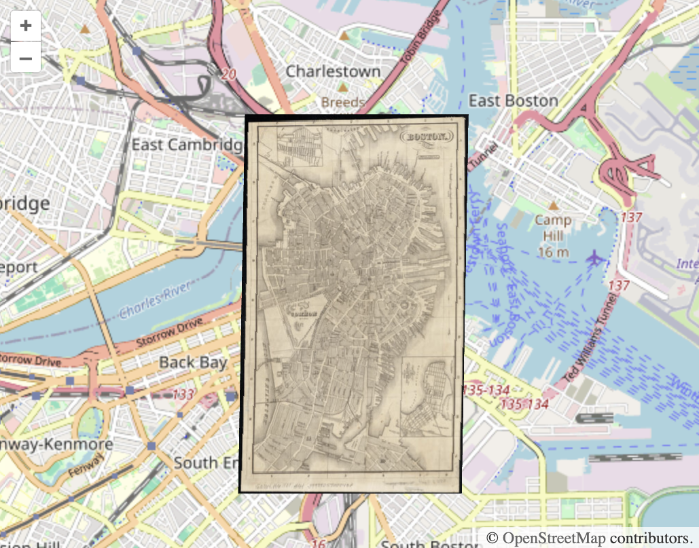

# @allmaps/openlayers

Plugin that uses WebGL to show warped IIIF images on an OpenLayers map. The plugin works by loading [Georeference Annotations](https://preview.iiif.io/api/georef/extension/georef/).

## How it works

This plugin creates a new class `WarpedMapLayer` which extends and behaves like a `L.Layer`. You can add one or multiple Georeference Annotations (or Georeference Annotation Pages) to a WarpedMapLayer, and add the WarpedMapLayer to your OpenLayers map. This will render all Georeferenced Maps contained in the annotation (pages) on your OpenLayers map!

What happens under the hood for each Georeferenced Map, is, in short, the following:

*   The Ground Control Points are read from the Georeference Annotation, and using those a transformation is computed from IIIF resource pixels to projected geo coordinates.
*   The Resource Mask is read from the Georeference Annotation, and the area within is divided into small triangles.
*   The Viewport is transformed from projected geo coordinates backwards to the resource image, and the IIIF tiles covering this viewport are fetched and cached.
*   The area inside the Resource Mask is rendered in the Viewport, triangle by triangle, using the cached tiles. The location of the triangles is computed using the forward transformation built from the Ground Control Points.

## Installation

This package works in browsers and in Node.js as an ESM module.

Install with npm:

```sh
npm install @allmaps/openlayers
```

And load using:

```js
import { WarpedMapLayer } from '@allmaps/openlayers'
```

Alternatively, ESM and UMD bundled versions of the code are also provided under `/dist/bundled`. You can load them directly in a HTML script tag using a CDN.

```html
<script src="https://cdn.jsdelivr.net/npm/@allmaps/openlayers/dist/bundled/allmaps-openlayers-8.umd.cjs"></script>
```

*Note: Replace the openLayer version number to the appropriate version for your use-case.*

When loading as bundled code, the package's functions are available under the `Allmaps` global variable:

```js
// ... (see 'Usage' below)
const warpedMapSource = new Allmaps.WarpedMapSource()
// ...
```

## Usage

Built for OpenLayers 8, but should work with OpenLayers 6 and OpenLayers 7 as well. See [the vite config](./vite.config.ts) for more information about globals, and the OpenLayers version for which it has been compiled.

### Loading an annotation

As is custom in OpenLayers, this package differentiates 'source' and 'layer'. In the Allmaps Leaflet package, this distinction is not made.

Create a source and layer and adding them to map looks like this:

```js
import { WarpedMapLayer, WarpedMapSource } from '@allmaps/openlayers'

// Create warpedMapSource and warpedMapLayer
const warpedMapSource = new WarpedMapSource()
const warpedMapLayer = new WarpedMapLayer({
  source: warpedMapSource
})

// OpenLayers map with OSM base layer and the warpedMapLayer
const map = new ol.Map({
  target: 'map',
  layers: [
    new ol.layer.Tile({
      source: new ol.source.OSM()
    }),
    warpedMapLayer
  ],
  view: new ol.View({
    center: ol.proj.fromLonLat([-71.0599, 42.3589]),
    zoom: 13
  })
})
```

A Georeference Annotation can be added to a WarpedMapSource using the functions `addGeoreferenceAnnotation()` or `addGeoreferenceAnnotationByUrl()`, which will render it as part of the WarpedMapLayer on the OpenLayers map. Here's an example of the first using `fetch()` and `then()`.

```js
const annotationUrl = 'https://annotations.allmaps.org/images/813b0579711371e2@2c1d7e89d8c309e8'

fetch(annotationUrl)
  .then((response) => response.json())
  .then((annotation) => {
    warpedMapSource.addGeoreferenceAnnotation(annotation)
  })
```

And here's an example of the later using a custom async function

```js
async function asyncAddGeoreferenceAnnotationByUrl() {
  // ...
  return await warpedMapSource.addGeoreferenceAnnotationByUrl(annotationUrl)
}
asyncAddGeoreferenceAnnotationByUrl()
```

### Example

<a href="https://codepen.io/mclaeysb/pen/RwvqNpe"></a>

Click the image above to see a live CodePen example of a minimal html file that loads an OpenLayers map, creates a Source and Layer and adds a Georeference Annotation to the Source to display it's Georeferenced Map on the OpenLayers map.

### Events

The following events are emitted to inform you of the state of the WarpedMapLayer, WarpedMapSource and rendering.

| Description                                                   | Type                      | Data                               |
|---------------------------------------------------------------|---------------------------|------------------------------------|
| A warped map has been added to the warped map list            | `warpedmapadded`          | `mapId: string`                    |
| A warped map has been removed from the warped map list        | `warpedmapremoved`        | `mapId: string`                    |
| A warped map enters the viewport                              | `warpedmapenter`          | `mapId: string`                    |
| A warped map leaves the viewport                              | `warpedmapleave`          | `mapId: string`                    |
| The visibility of some warpedMaps has changed                 | `visibilitychanged`       | `mapIds: string[]`                 |
| The cache loaded a first tile of a map                        | `firstmaptileloaded`      | `{mapId: string, tileUrl: string}` |
| All tiles requested for the current viewport have been loaded | `allrequestedtilesloaded` | `{}`                               |

You can listen to them in the typical OpenLayers way. Here's an example:

```js
map.on('warpedmapadded', (event) => {console.log(event.mapId, warpedMapSource.getTotalBounds())}, map)
```

Some of the functions specified in the API only make sense once a warped map is loaded into the WarpedMapSource. You can use such listeners to make sure function are run e.g. only after a warped map has been added.

### What is a 'map'?

Both OpenLayers and Allmaps have a concept named a 'map'.

A OpenLayers map is an instance of the [OpenLayers Map Class](https://openlayers.org/en/latest/apidoc/module-ol_Map-Map.html), the central class of the OpenLayers API, used to create a map on a page and manipulate it.

In Allmaps there are multiple classes describing maps, one for each phase a map takes through the Allmaps rendering pipeline:

*   When a Georeference Annotation is parsed, an instance of the Georeferenced Map class is created from it.
*   When this map is loaded into an application for rendering, an instance of the Warped Map class is created from it.
*   (Inside the WebGL2 rendering code, there's also a WebGL2WarpedMap)

All these map phases originating from the same Georeference Annotation have the same unique `mapId` property. This string value is used though-out Allmaps (and in the API below) to identify a map. It is returned after adding a georeference annotation to a warpedMapLayer, so you can use it later to call functions on a specific map.

## API

<!-- Generated by documentation.js. Update this documentation by updating the source code. -->

#### Table of Contents

*   [Point](#point)
*   [Bbox](#bbox)
*   [TransformationType](#transformationtype)
*   [WarpedMapLayer](#warpedmaplayer)
    *   [getContainer](#getcontainer)
    *   [getCanvas](#getcanvas)
    *   [setMapOpacity](#setmapopacity)
    *   [resetMapOpacity](#resetmapopacity)
    *   [setSaturation](#setsaturation)
    *   [resetSaturation](#resetsaturation)
    *   [setMapSaturation](#setmapsaturation)
    *   [resetMapSaturation](#resetmapsaturation)
    *   [setRemoveColor](#setremovecolor)
    *   [resetRemoveColor](#resetremovecolor)
    *   [setMapRemoveColor](#setmapremovecolor)
    *   [resetMapRemoveColor](#resetmapremovecolor)
    *   [setColorize](#setcolorize)
    *   [resetColorize](#resetcolorize)
    *   [setMapColorize](#setmapcolorize)
    *   [resetMapColorize](#resetmapcolorize)
    *   [dispose](#dispose)
    *   [render](#render)
*   [WarpedMapSource](#warpedmapsource)
    *   [addGeoreferenceAnnotation](#addgeoreferenceannotation)
    *   [removeGeoreferenceAnnotation](#removegeoreferenceannotation)
    *   [addGeoreferenceAnnotationByUrl](#addgeoreferenceannotationbyurl)
    *   [removeGeoreferenceAnnotationByUrl](#removegeoreferenceannotationbyurl)
    *   [addGeoreferencedMap](#addgeoreferencedmap)
    *   [removeGeoreferencedMap](#removegeoreferencedmap)
    *   [getWarpedMapList](#getwarpedmaplist)
    *   [getWarpedMap](#getwarpedmap)
    *   [showMap](#showmap)
    *   [showMaps](#showmaps)
    *   [hideMap](#hidemap)
    *   [hideMaps](#hidemaps)
    *   [isMapVisible](#ismapvisible)
    *   [setMapResourceMask](#setmapresourcemask)
    *   [setMapsTransformationType](#setmapstransformationtype)
    *   [getTotalBbox](#gettotalbbox)
    *   [getTotalProjectedBbox](#gettotalprojectedbbox)
    *   [bringMapsToFront](#bringmapstofront)
    *   [sendMapsToBack](#sendmapstoback)
    *   [bringMapsForward](#bringmapsforward)
    *   [sendMapsBackward](#sendmapsbackward)
    *   [getMapZIndex](#getmapzindex)
    *   [setImageInfoCache](#setimageinfocache)
    *   [clear](#clear)

### Point

Point

Type: \[[number](https://developer.mozilla.org/docs/Web/JavaScript/Reference/Global_Objects/Number), [number](https://developer.mozilla.org/docs/Web/JavaScript/Reference/Global_Objects/Number)]

### Bbox

Bounding box

Type: \[[number](https://developer.mozilla.org/docs/Web/JavaScript/Reference/Global_Objects/Number), [number](https://developer.mozilla.org/docs/Web/JavaScript/Reference/Global_Objects/Number), [number](https://developer.mozilla.org/docs/Web/JavaScript/Reference/Global_Objects/Number), [number](https://developer.mozilla.org/docs/Web/JavaScript/Reference/Global_Objects/Number)]

### TransformationType

Transformation type

Type: (`"helmert"` | `"polynomial"` | `"polynomial1"` | `"polynomial2"` | `"polynomial3"` | `"projective"` | `"thinPlateSpline"`)

### WarpedMapLayer

WarpedMapLayer class.

Together with a WarpedMapSource, this class renders georeferenced maps of a IIIF Georeference Annotation on an OpenLayers map.
WarpedMapLayer is a subclass of [Layer](https://openlayers.org/en/latest/apidoc/module-ol_layer_Layer-Layer.html).

#### getContainer

Gets the HTML container element of the layer

Returns **[HTMLElement](https://developer.mozilla.org/docs/Web/HTML/Element)** HTML Div Element

#### getCanvas

Gets the HTML canvas element of the layer

Returns **([HTMLCanvasElement](https://developer.mozilla.org/docs/Web/API/HTMLCanvasElement) | null)** HTML Canvas Element

#### setMapOpacity

Sets the opacity of a single map

##### Parameters

*   `mapId` **[string](https://developer.mozilla.org/docs/Web/JavaScript/Reference/Global_Objects/String)** ID of the map
*   `opacity` **[number](https://developer.mozilla.org/docs/Web/JavaScript/Reference/Global_Objects/Number)** opacity between 0 and 1, where 0 is fully transparent and 1 is fully opaque

#### resetMapOpacity

Resets the opacity of a single map to fully opaque

##### Parameters

*   `mapId` **[string](https://developer.mozilla.org/docs/Web/JavaScript/Reference/Global_Objects/String)** ID of the map

#### setSaturation

Sets the saturation of a single map

##### Parameters

*   `saturation` **[number](https://developer.mozilla.org/docs/Web/JavaScript/Reference/Global_Objects/Number)** saturation between 0 and 1, where 0 is grayscale and 1 are the original colors

#### resetSaturation

Resets the saturation of a single map to the original colors

#### setMapSaturation

Sets the saturation of a single map

##### Parameters

*   `mapId` **[string](https://developer.mozilla.org/docs/Web/JavaScript/Reference/Global_Objects/String)** ID of the map
*   `saturation` **[number](https://developer.mozilla.org/docs/Web/JavaScript/Reference/Global_Objects/Number)** saturation between 0 and 1, where 0 is grayscale and 1 are the original colors

#### resetMapSaturation

Resets the saturation of a single map to the original colors

##### Parameters

*   `mapId` **[string](https://developer.mozilla.org/docs/Web/JavaScript/Reference/Global_Objects/String)** ID of the map

#### setRemoveColor

Removes a color from all maps

##### Parameters

*   `options` **[Object](https://developer.mozilla.org/docs/Web/JavaScript/Reference/Global_Objects/Object)** remove color options

    *   `options.hexColor` **[string](https://developer.mozilla.org/docs/Web/JavaScript/Reference/Global_Objects/String)?** hex color to remove
    *   `options.threshold` **[number](https://developer.mozilla.org/docs/Web/JavaScript/Reference/Global_Objects/Number)?** threshold between 0 and 1
    *   `options.hardness` **[number](https://developer.mozilla.org/docs/Web/JavaScript/Reference/Global_Objects/Number)?** hardness between 0 and 1

#### resetRemoveColor

Resets the color removal for all maps

#### setMapRemoveColor

Removes a color from a single map

##### Parameters

*   `mapId` **[string](https://developer.mozilla.org/docs/Web/JavaScript/Reference/Global_Objects/String)** ID of the map
*   `options` **[Object](https://developer.mozilla.org/docs/Web/JavaScript/Reference/Global_Objects/Object)** remove color options

    *   `options.hexColor` **[string](https://developer.mozilla.org/docs/Web/JavaScript/Reference/Global_Objects/String)?** hex color to remove
    *   `options.threshold` **[number](https://developer.mozilla.org/docs/Web/JavaScript/Reference/Global_Objects/Number)?** threshold between 0 and 1
    *   `options.hardness` **[number](https://developer.mozilla.org/docs/Web/JavaScript/Reference/Global_Objects/Number)?** hardness between 0 and 1

#### resetMapRemoveColor

Resets the color for a single map

##### Parameters

*   `mapId` **[string](https://developer.mozilla.org/docs/Web/JavaScript/Reference/Global_Objects/String)** ID of the map

#### setColorize

Sets the colorization for all maps

##### Parameters

*   `hexColor` **[string](https://developer.mozilla.org/docs/Web/JavaScript/Reference/Global_Objects/String)** desired hex color

#### resetColorize

Resets the colorization for all maps

#### setMapColorize

Sets the colorization for a single mapID of the map

##### Parameters

*   `mapId` **[string](https://developer.mozilla.org/docs/Web/JavaScript/Reference/Global_Objects/String)** ID of the map
*   `hexColor` **[string](https://developer.mozilla.org/docs/Web/JavaScript/Reference/Global_Objects/String)** desired hex color

#### resetMapColorize

Resets the colorization of a single warped map

##### Parameters

*   `mapId` **[string](https://developer.mozilla.org/docs/Web/JavaScript/Reference/Global_Objects/String)** ID of the map

#### dispose

Disposes all WebGL resources and cached tiles

#### render

Render the layer.

##### Parameters

*   `frameState` &#x20;

Returns **[HTMLElement](https://developer.mozilla.org/docs/Web/HTML/Element)** The rendered element

### WarpedMapSource

WarpedMapSource class. Together with a [WarpedMapLayer](#warpedmaplayer), this class
renders a warped map on an OpenLayers map.

#### addGeoreferenceAnnotation

Adds a [Georeference Annotation](https://iiif.io/api/extension/georef/).

##### Parameters

*   `annotation` **any** Georeference Annotation

Returns **[Promise](https://developer.mozilla.org/docs/Web/JavaScript/Reference/Global_Objects/Promise)<[Array](https://developer.mozilla.org/docs/Web/JavaScript/Reference/Global_Objects/Array)<([string](https://developer.mozilla.org/docs/Web/JavaScript/Reference/Global_Objects/String) | [Error](https://developer.mozilla.org/docs/Web/JavaScript/Reference/Global_Objects/Error))>>** the map IDs of the maps that were added, or an error per map

#### removeGeoreferenceAnnotation

Removes a [Georeference Annotation](https://iiif.io/api/extension/georef/).

##### Parameters

*   `annotation` **any** Georeference Annotation

Returns **[Promise](https://developer.mozilla.org/docs/Web/JavaScript/Reference/Global_Objects/Promise)<[Array](https://developer.mozilla.org/docs/Web/JavaScript/Reference/Global_Objects/Array)<([string](https://developer.mozilla.org/docs/Web/JavaScript/Reference/Global_Objects/String) | [Error](https://developer.mozilla.org/docs/Web/JavaScript/Reference/Global_Objects/Error))>>** the map IDs of the maps that were removed, or an error per map

#### addGeoreferenceAnnotationByUrl

Adds a [Georeference Annotation](https://iiif.io/api/extension/georef/) by URL.

##### Parameters

*   `annotationUrl` **[string](https://developer.mozilla.org/docs/Web/JavaScript/Reference/Global_Objects/String)** Georeference Annotation

Returns **[Promise](https://developer.mozilla.org/docs/Web/JavaScript/Reference/Global_Objects/Promise)<[Array](https://developer.mozilla.org/docs/Web/JavaScript/Reference/Global_Objects/Array)<([string](https://developer.mozilla.org/docs/Web/JavaScript/Reference/Global_Objects/String) | [Error](https://developer.mozilla.org/docs/Web/JavaScript/Reference/Global_Objects/Error))>>** the map IDs of the maps that were added, or an error per map

#### removeGeoreferenceAnnotationByUrl

Removes a [Georeference Annotation](https://iiif.io/api/extension/georef/) by URL.

##### Parameters

*   `annotationUrl` **[string](https://developer.mozilla.org/docs/Web/JavaScript/Reference/Global_Objects/String)** Georeference Annotation

Returns **[Promise](https://developer.mozilla.org/docs/Web/JavaScript/Reference/Global_Objects/Promise)<[Array](https://developer.mozilla.org/docs/Web/JavaScript/Reference/Global_Objects/Array)<([string](https://developer.mozilla.org/docs/Web/JavaScript/Reference/Global_Objects/String) | [Error](https://developer.mozilla.org/docs/Web/JavaScript/Reference/Global_Objects/Error))>>** the map IDs of the maps that were removed, or an error per map

#### addGeoreferencedMap

Adds a Georeferenced map.

##### Parameters

*   `georeferencedMap` **unknown** Georeferenced map

Returns **[Promise](https://developer.mozilla.org/docs/Web/JavaScript/Reference/Global_Objects/Promise)<([string](https://developer.mozilla.org/docs/Web/JavaScript/Reference/Global_Objects/String) | [Error](https://developer.mozilla.org/docs/Web/JavaScript/Reference/Global_Objects/Error))>** the map ID of the map that was added, or an error

#### removeGeoreferencedMap

Removes a Georeferenced map.

##### Parameters

*   `georeferencedMap` **unknown** Georeferenced map

Returns **[Promise](https://developer.mozilla.org/docs/Web/JavaScript/Reference/Global_Objects/Promise)<([string](https://developer.mozilla.org/docs/Web/JavaScript/Reference/Global_Objects/String) | [Error](https://developer.mozilla.org/docs/Web/JavaScript/Reference/Global_Objects/Error))>** the map ID of the map that was remvoed, or an error

#### getWarpedMapList

Returns the WarpedMapList object that contains a list of the warped maps of all loaded maps

Returns **WarpedMapList** the warped map list

#### getWarpedMap

Returns a single map's warped map

##### Parameters

*   `mapId` **[string](https://developer.mozilla.org/docs/Web/JavaScript/Reference/Global_Objects/String)** ID of the map

Returns **(WarpedMap | [undefined](https://developer.mozilla.org/docs/Web/JavaScript/Reference/Global_Objects/undefined))** the warped map

#### showMap

Make a single map visible

##### Parameters

*   `mapId` **[string](https://developer.mozilla.org/docs/Web/JavaScript/Reference/Global_Objects/String)** ID of the map

#### showMaps

Make multiple maps visible

##### Parameters

*   `mapIds` **Iterable<[string](https://developer.mozilla.org/docs/Web/JavaScript/Reference/Global_Objects/String)>** IDs of the maps

#### hideMap

Make a single map invisible

##### Parameters

*   `mapId` **[string](https://developer.mozilla.org/docs/Web/JavaScript/Reference/Global_Objects/String)** ID of the map

#### hideMaps

Make multiple maps invisible

##### Parameters

*   `mapIds` **Iterable<[string](https://developer.mozilla.org/docs/Web/JavaScript/Reference/Global_Objects/String)>** IDs of the maps

#### isMapVisible

Returns the visibility of a single map

##### Parameters

*   `mapId` &#x20;

Returns **([boolean](https://developer.mozilla.org/docs/Web/JavaScript/Reference/Global_Objects/Boolean) | [undefined](https://developer.mozilla.org/docs/Web/JavaScript/Reference/Global_Objects/undefined))** whether the map is visible

#### setMapResourceMask

Sets the resource mask of a single map

##### Parameters

*   `mapId` **[string](https://developer.mozilla.org/docs/Web/JavaScript/Reference/Global_Objects/String)** ID of the map
*   `resourceMask` **Ring** new resource mask

#### setMapsTransformationType

Sets the transformation type of multiple maps

##### Parameters

*   `mapIds` **Iterable<[string](https://developer.mozilla.org/docs/Web/JavaScript/Reference/Global_Objects/String)>** IDs of the maps
*   `transformation` **[TransformationType](#transformationtype)** new transformation type

#### getTotalBbox

Return the Bbox of all visible maps in the layer (inside or outside of the Viewport), in lon lat coordinates.

Returns **([Bbox](#bbox) | [undefined](https://developer.mozilla.org/docs/Web/JavaScript/Reference/Global_Objects/undefined))** bbox of all warped maps

#### getTotalProjectedBbox

Return the Bbox of all visible maps in the layer (inside or outside of the Viewport), in projected coordinates.

Returns **([Bbox](#bbox) | [undefined](https://developer.mozilla.org/docs/Web/JavaScript/Reference/Global_Objects/undefined))** bbox of all warped maps

#### bringMapsToFront

Bring maps to front

##### Parameters

*   `mapIds` **Iterable<[string](https://developer.mozilla.org/docs/Web/JavaScript/Reference/Global_Objects/String)>** IDs of the maps

#### sendMapsToBack

Send maps to back

##### Parameters

*   `mapIds` **Iterable<[string](https://developer.mozilla.org/docs/Web/JavaScript/Reference/Global_Objects/String)>** IDs of the maps

#### bringMapsForward

Bring maps forward

##### Parameters

*   `mapIds` **Iterable<[string](https://developer.mozilla.org/docs/Web/JavaScript/Reference/Global_Objects/String)>** IDs of the maps

#### sendMapsBackward

Send maps backward

##### Parameters

*   `mapIds` **Iterable<[string](https://developer.mozilla.org/docs/Web/JavaScript/Reference/Global_Objects/String)>** IDs of the maps

#### getMapZIndex

Returns the z-index of a single map

##### Parameters

*   `mapId` **[string](https://developer.mozilla.org/docs/Web/JavaScript/Reference/Global_Objects/String)** ID of the warped map

Returns **([number](https://developer.mozilla.org/docs/Web/JavaScript/Reference/Global_Objects/Number) | [undefined](https://developer.mozilla.org/docs/Web/JavaScript/Reference/Global_Objects/undefined))** z-index of the warped map

#### setImageInfoCache

Sets the image info Cache of the warpedMapList, informing it's warped maps about possibly cached imageInfo.

##### Parameters

*   `cache` **Cache** the image info cache

#### clear

Clears the source, removes all maps
